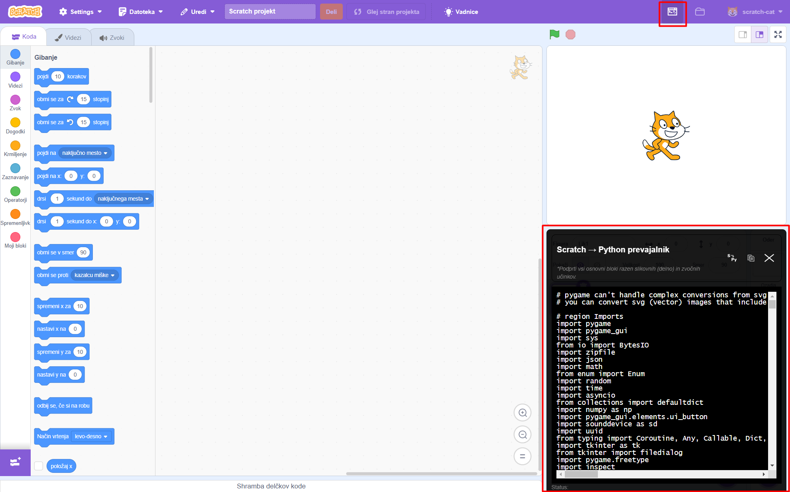

# Scratch blocks to Python transpiler GUI

This is a project for translating Scratch blocks and scripts to Python code. 
Specifically this repositroy contains the GUI part of Scratch and transpiler - React components that make up the interface for creating and running Scratch 3.0 projects.

## Description

This project is basically the same as the original Scratch GUI project, but with the added Python transpiler.
In the top right corner, a you can click on the transpiler icon, which will open the transpiler in the bottom right corner.
The transpiler will then translate added blocks or scripts of blocks and all required assets to Python code in real time and show them in the transpiler window.
You can then copy the Python code and paste it in arbitrary IDE which supports Python and run it. Python code should show the same or similar result as the Scratch display window.



### Notes

- Transpiler will only translate blocks if it's open, but it will do that in real time. If for some reason it doesn't translate, you can manually translate it with the click on a button in the transpiler window.
- All blocks supported except User defined blocks, sound effects and partially image effects.
- Transpiler will only translate scripts of blocks that start with an event block.
- You need to supply assets from Scratch to Python program on startup - download sprites by right clicking on sprites in sprite window, stage backdrops and sounds by right clicking on backdrops or sounds in stage window.
- In Python code, pygame works only with bitmap images, so it converts vector images (like svg) to png. It can't process some tags, for example text. Because of this, some images might not be shown correctly - specifically text. To prevent this, you can convert images to bitmap format inside Scratch website.

## Installation

Because this is a local project, installation is required.
To run the project, you will also need a Scratch VM from [this repository](https://github.com/mh4043/scratch-blocks-to-python-transpiler-vm).
How to connect these two repositores is described below.

### Prerequisites

- Installed Node version 20.12.2. or above
- Installed Python version 3.12.3. or above

### Installation steps

1. Open Node.js command prompt and make a folder where you will have both repositores.
2. In that folder, type the following command:
   ```bash
   git clone https://github.com/mh4043/scratch-blocks-to-python-transpiler-gui.git
   ```
   This creates a folder "scratch-blocks-to-python-transpiler-gui".
3. In the same folder, type the following command:
   ```bash
   git clone https://github.com/mh4043/scratch-blocks-to-python-transpiler-vm.git
   ```
   This creates a folder "scratch-blocks-to-python-transpiler-vm".
4. Go to folder "scratch-blocks-to-python-transpiler-vm" and type the following commands:
   ```bash
   npm install
   npm link
   ```
   This installs the packages and links the two folders together.
5. Go to folder "scratch-blocks-to-python-transpiler-gui" and type the following commands:
   ```bash
   npm install
   npm link scratch-vm
   ```
   This installs the packages and links the two folders together.
6. To run the server, run the following command from folder "scratch-blocks-to-python-transpiler-gui":
   ```bash
   npm start
   ```
   This will start the server and print out the link to where the project is running.
   It is usually at "http://localhost:8601/" or "http://localhost:8602/". Copy this and paste it in browser.
   Now you should have a working local Scratch website with Python transpiler.
7. For the purposes of running the Python program in arbitrary IDE after translation, you should run the following command in folder "scratch-blocks-to-python-transpiler-gui".
   ```bash
   pip install -r python_transpiler_requirements.txt
   ```
   This installs the required libraries that Python uses.
    
For more information about setting up both repositories and troubleshooting, look at the original repositories from which these two were forked.
